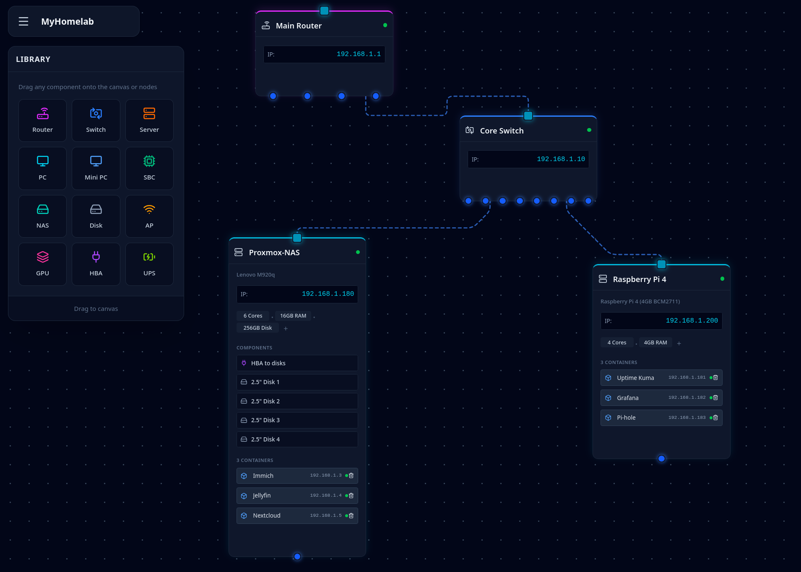

# InfraMapper

An IT infrastructure mapping tool. Visualize your compute nodes, networking equipment, and infrastructure on an infinite canvas with support for IP addresses, hardware specs, and running services.

## Features

-   **Infinite Canvas** - Pannable and zoomable workspace with a dot grid background
-   **Drag & Drop** - Drag nodes from the component library directly onto the canvas
-   **Node Types** - Support for routers, switches, servers, PCs, mini PCs, SBCs (Raspberry Pi), NAS, access points, GPUs, HBAs, UPS units, and disks
-   **Editable Properties** - Name, subtitle, IP address, and hardware specs for each node
-   **Internal Components** - Attach GPUs, HBAs, and disks to nodes
-   **Container/VM Tracking** - Track running services with name and IP address per node
-   **Visual Connections** - Connect nodes via input/output ports with animated curved lines
-   **Map Title** - Rename your infrastructure map via the top navigation

## Screenshot



## Tech Stack

-   **Framework:** React 19
-   **Build Tool:** Vite
-   **Styling:** Tailwind CSS
-   **Linting:** ESLint

## Prerequisites

Before you begin, ensure you have the following installed on your system:
-   [Node.js](https://nodejs.org/en/) (v18.x or later recommended)
-   [npm](https://www.npmjs.com/) (usually comes with Node.js) or [Yarn](https://yarnpkg.com/)

## Quick Start

To get a local copy up and running, follow these simple steps.

1.  **Clone the repository:**
    ```sh
    git clone git@github.com:your-username/InfraMapper.git
    cd InfraMapper
    ```

2.  **Install dependencies:**
    ```sh
    npm install
    ```
    or if you use Yarn:
    ```sh
    yarn install
    ```

3.  **Run the development server:**
    ```sh
    npm run dev
    ```
    This will start the Vite development server. Open your browser and navigate to `http://localhost:5173` (or the port shown in your terminal) to see the application.

## Available Scripts

In the project directory, you can run the following commands:

-   `npm run dev`: Runs the app in development mode.
-   `npm run build`: Builds the app for production to the `dist` folder. It correctly bundles React in production mode and optimizes the build for the best performance.
-   `npm run lint`: Lints the project files for code quality and style issues using ESLint.
-   `npm run preview`: Serves the production build from the `dist` folder locally to preview it before deployment.

## AI Disclosure Acknowledgment

Principally AI Creation. The following code was primarily written using AI-based system (Gemini). Most of the components were generated by AI with minimal human editing.

## Contributing

Contributions are what make the open-source community such an amazing place to learn, inspire, and create. Any contributions you make are **greatly appreciated**.

If you have a suggestion that would make this better, please fork the repo and create a pull request. You can also simply open an issue with the tag "enhancement".

1.  Fork the Project
2.  Create your Feature Branch (`git checkout -b feature/AmazingFeature`)
3.  Commit your Changes (`git commit -m 'Add some AmazingFeature'`)
4.  Push to the Branch (`git push origin feature/AmazingFeature`)
5.  Open a Pull Request

## License

Distributed under the MIT License. See `LICENSE` for more information.
